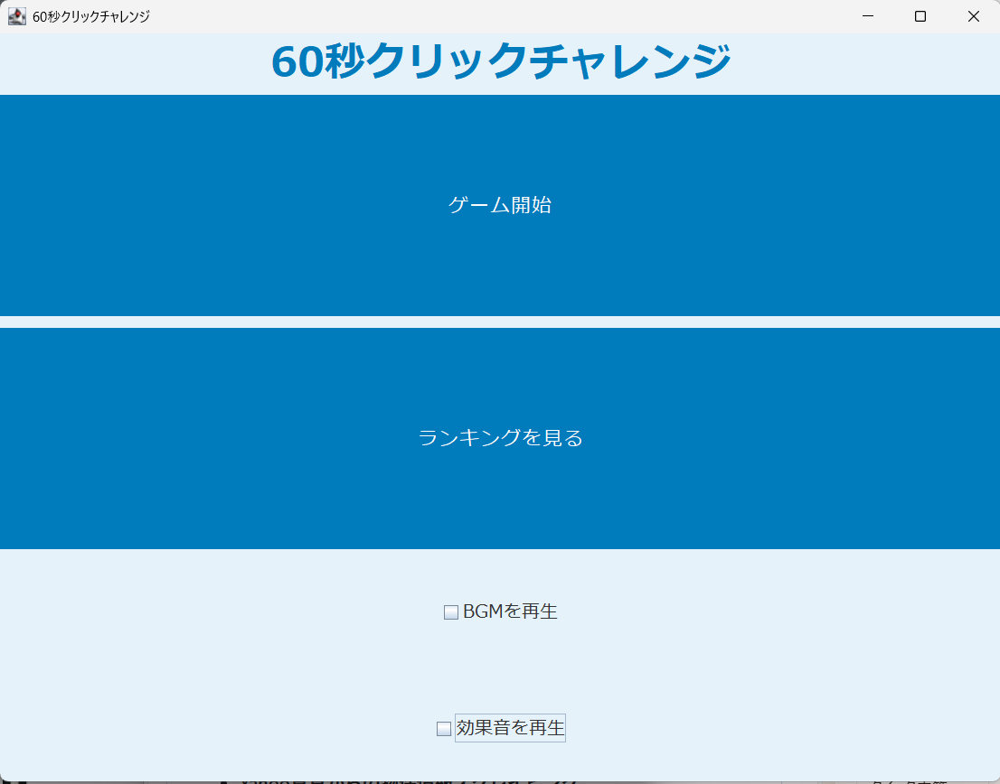
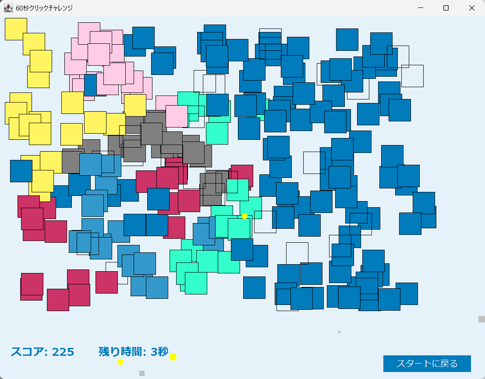
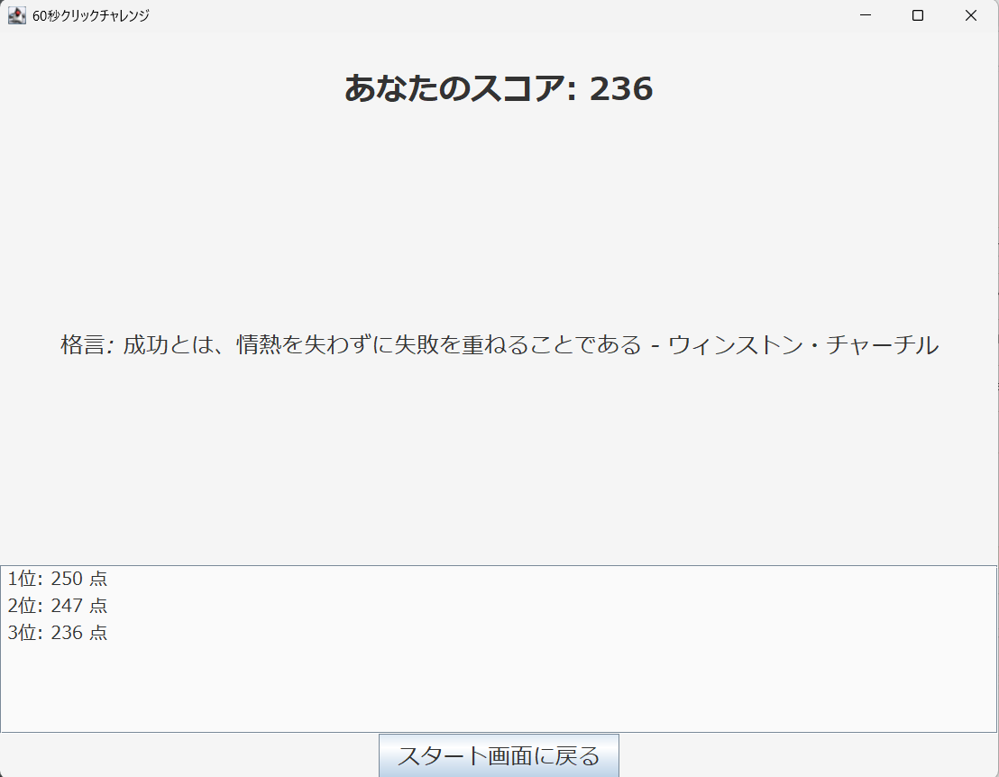

# Click Challenge 【60秒クリックチャレンジ】癒し系クリックゲーム（Java/Swing）

##ゲーム概要
60秒間、ひたすらタイルをクリックしてスコアを競う、癒しと達成感を両立したデスクトップゲームです。
柔らかな色彩と効果音、コンフェッティ演出で、視覚・聴覚・感情に心地よいフィードバックを提供します。

### 解決する課題
- シンプルな操作で、短時間でも達成感が得られる
- 音や色のフィードバックにより、ユーザーの集中力と満足感を高める
- 必要最低限にやさしいUI/UXを重視し、誰でも安心して遊べる設計

---

## ターゲットユーザー / ペルソナ
**感覚的な達成感を求めるライトゲーマー / UIの基本を学ぶデザイナー志望者**  
- 仕事や勉強の合間に、短時間でリフレッシュしたい人  
- 音・色・動きのフィードバックに敏感な人
- シンプルな操作性という最小単位でのUI/UXの設計に関心があり、参考になる実装を探している人

### なぜこのペルソナに焦点を当てたか
自分自身が「癒しと達成感のバランス」にこだわって設計したため。 また、ポートフォリオとしてシンプルで簡単、邪魔にならないUI/UXの配慮が伝わる作品にしたかったから。

---

## 機能一覧
- **60秒間のクリックチャレンジ**
- クリック判定とスコア加算
- クリック成功時の色変化とコンフェッティ演出
- **BGM・効果音のON/OFF切り替え**
- ゲーム終了後のスコア表示（ランキング画面）
- アクセシビリティ配慮（音の自律制御、明瞭なUI）

---

## ペルソナが重視する体験と設計意図
- **視覚的にやさしい配色（淡いブルー、角丸ボタン）**
- **音のON/OFFを自分で選べる安心設計**
- **クリック時のフィードバックが明確で気持ちいい**
- **短時間で完結するゲーム性**

> 「やさしさ」「達成感」「自律性」を重視した設計

---

## 使用技術
- **Java 17 / Swing UI**
- **自作サウンドマネージャー（Clip API）**
- **モジュール設計（StartScreen / GamePanel / SoundManager など）**
- **Audacityで音声編集（PCM WAV形式）**

---

## プロジェクト構成
click-challenge-java/

├── src/jp/portfolio/clickchallenge/ 

│ ├── Main.java # エントリーポイント 

│ ├── StartScreen.java # スタート画面 

│ ├── GamePanel.java # ゲームロジック 

│ ├── SoundManager.java # 音声管理 

│ ├── Tile.java # タイルオブジェクト 

│ └── Confetti.java # 紙吹雪演出

├── assets/ 

│ ├── bgm.wav # BGM（癒し系） 

│ ├── click.wav # 効果音（柔らかいポン音） 

│ └── screenshot_title.png # タイトル画面（任意）

├── README.md # プロジェクト説明

---

## 実行方法

### 1. 環境構築
1. Java 17 以上をインストール
2. Eclipse または IntelliJ でプロジェクトを開く

### 2. 音源配置

- assets/ フォルダに bgm.wav と click.wav を配置

- 音声は PCM形式のWAVファイルを使用（MP3不可）

### 3. 実行手順

- Main.java を実行 
→ スタート画面が表示され、60秒チャレンジが開始できます

## 実行結果

**表示内容**

- スコアカウント
- コンフェッティ演出
- BGM・効果音の再生状態
- ゲーム終了後のスコア表示

**スクリーンショット：**

**実行デモ動画(0:37)：**                                               
https://1drv.ms/v/c/aa77078cc99cfacf/EbdJc-LoJidJj-fDJYOKwHMBVPpHavCCTagIxb8X7NwQKA

## ゲーム公開ページ（itch.io）
以下のURLから、ゲームをダウンロードしてプレイできます。 
👉 [Click Challenge – A Soothing 60-Second Game](https://ma0830.itch.io/click-challenge-a-soothing-60-second-game)

本作は、Java/Swingで開発した60秒間のクリックチャレンジゲームです。  
柔らかな色彩と効果音、シンプルで心地よいUIを通じて、癒しと達成感を提供します。

## 技術的ハイライト

- UI/UXに配慮したモダンなボタン設計
- 音声のON/OFF制御と再生管理（Clip API）
- コンフェッティ演出による達成感の強化
- モジュール分割による保守性の高い設計

## 今後の展望

- スコアの保存と履歴表示
- 難易度選択（時間やタイル数の変更）
- ゲーム終了後のSNS共有機能

 
 

***
English Version

# Click Challenge - A Soothing 60-Second Click Game (Java/Swing)

## Project Overview  
Click Challenge is a desktop game that blends relaxation and achievement in a 60-second click challenge.  
With soft visuals, gentle sound effects, and confetti animations, it offers satisfying feedback through sight, sound, and emotion.

### Problems Solved  
- Provides a sense of accomplishment in short play sessions  
- Enhances focus and satisfaction through responsive audio-visual feedback  
- Prioritizes minimal, gentle UI/UX for a stress-free experience

---

## Target Users / Persona  
**Casual gamers seeking sensory satisfaction / UI-focused design learners**  
- People who want a quick refresh between work or study  
- Sensitive to visual and auditory feedback  
- Interested in learning UI/UX through simple, focused interactions

### Why This Persona  
The game was designed from personal experience, balancing calmness and reward.  
It also serves as a portfolio piece to showcase thoughtful, unobtrusive UI/UX design.

---

## Features  
- **60-second click challenge**  
- Click detection and score tracking  
- Color transitions and confetti effects on success  
- **Toggleable BGM and sound effects**  
- Score display after game ends  
- Accessibility-conscious design (audio control, clear UI)

---

## Design Intent  
- **Soft color palette and rounded buttons**  
- **User-controlled audio settings for autonomy**  
- **Clear feedback on interaction**  
- **Short, complete gameplay loop**

> Designed with “gentleness,” “achievement,” and “autonomy” in mind

---

## Technologies Used  
- **Java 17 / Swing UI**  
- **Custom SoundManager using Clip API**  
- **Modular architecture (StartScreen / GamePanel / SoundManager)**  
- **Audacity for PCM WAV audio editing**

---

## Project Structure  
click-challenge-java/

├── src/jp/portfolio/clickchallenge/  
│ ├── Main.java # Entry point  
│ ├── StartScreen.java # Start screen  
│ ├── GamePanel.java # Game logic  
│ ├── SoundManager.java # Audio control  
│ ├── Tile.java # Tile object  
│ └── Confetti.java # Confetti animation  
├── assets/  
│ ├── bgm.wav # Background music  
│ ├── click.wav # Click sound  
│ └── screenshot_title.png # Optional screenshot  
├── README.md # Project description

---

## How to Run

### 1. Setup  
- Install Java 17 or higher  
- Open the project in Eclipse or IntelliJ

### 2. Audio Files  
- Place `bgm.wav` and `click.wav` in the `assets/` folder  
- Use PCM WAV format (MP3 not supported)

### 3. Run  
- Execute `Main.java`  
→ The start screen will appear and the 60-second challenge begins

---

## Output

**Displayed Elements**  
- Score counter  
- Confetti animation  
- BGM and SE playback status  
- Final score screen

**Screenshots:**  
  
  

**Demo Video (0:37):**  
[Watch on OneDrive](https://1drv.ms/v/c/aa77078cc99cfacf/EbdJc-LoJidJj-fDJYOKwHMBVPpHavCCTagIxb8X7NwQKA)

## Play the Game
You can download and play the game from the following itch.io page:  
👉 [Click Challenge – A Soothing 60-Second Game](https://ma0830.itch.io/click-challenge-a-soothing-60-second-game)

This is a 60-second click challenge game built with Java/Swing.  
It offers a soothing experience through soft visuals, gentle sound effects, and a minimalist UI.

---

## Technical Highlights  
- Modern button design with UX in mind  
- Toggleable audio playback using Clip API  
- Confetti animation for rewarding feedback  
- Modular code structure for maintainability

## Future Plans  
- Score saving and history  
- Difficulty settings

 
 
